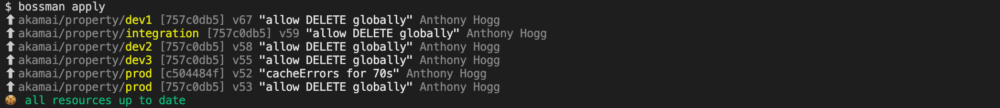
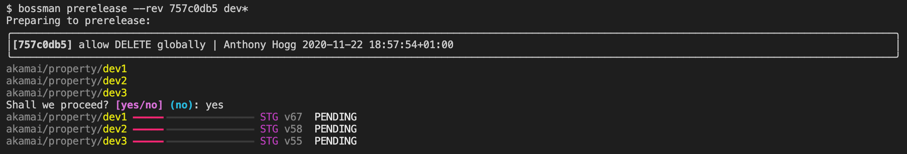
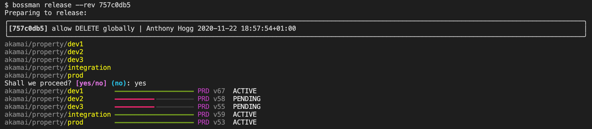
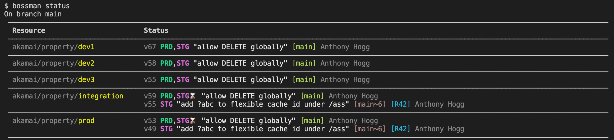

Bossman Docs
===================================

Bossman is a command line tool for Akamai GitOps. It helps automate the deployment and release management
of Akamai product configurations that are maintained in git.

It tries hard to be a very thin glue between git and your infrastructure, providing a simple command line
interface to manage the lifecycle of your configuration changes through simple commands:

* ``bossman apply`` - synchronize git commits to the infrastructure

* ``bossman prerelease --rev 757c0db5 dev*`` - make a specific revision live for testing

* ``bossman release --rev 757c0db5`` - make a specific revision live to end users

* ``bossman status`` - show the state of the infrastructure

Because Bossman is simply built "on top of git", it is possible to implement many workflows with ease.

* One single environment
* Linear promotional deployment - dev, integration, qa, preprod, prod
* Distributed development - work in parallel on multiple dev environments
* SaaS or regional model - one template and many production environments with small variations

.. toctree::
   :maxdepth: 1
   :caption: Contents:

   install
   usage
   quickstarts
   plugins
   philosophy

.. topic:: About the author

   My name is Anthony Hogg, and I am an Enterprise Architect working at Akamai Technologies. I maintain
   Bossman to help my customers apply DevOps methodologies to their Akamai configurations in those cases
   where existing tooling is not a perfect fit.

.. topic:: Disclaimer

   Bossman is not officially supported by Akamai Technologies. I provide support, fixes and features
   on a best-effort basis with a priority on the requirements of my customers, but I also try to be as
   responsive as possible, and welcome contributions.
