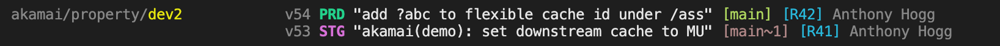
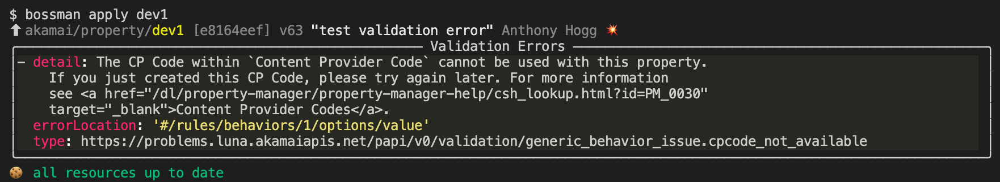
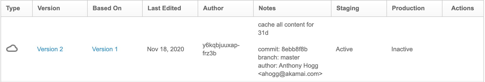
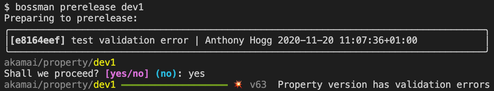

.. _plugins_akamai_property:

Akamai Property
================================

This page provides reference information about how bossman commands relate to
Akamai Property management.

Resource Configuration
________________________________

.. code-block:: yaml

  resources:
    - module: bossman.plugins.akamai.property
      pattern: akamai/property/{name}
      options:
        edgerc: ~/.edgerc
        section: papi
        switch_key: xyz

The above are the default values, applied even if the ``.bossman`` configuration file is
not present. You only need to configure if you need to depart from the defaults.

With these defaults, Bossman will look for folders under ``akamai/property`` and treat
them as Akamai Property configurations. The ``{name}`` placeholder is required and defines
the name of the property to be managed.

The next section details the structure of the resource, the files Bossman expects to find
within the property configuration folder.

Resource Structure
________________________________

An Akamai property is composed of two files:

* ``hostnames.json`` with the host -> edgehostname mapping information
* ``rules.json`` with the CDN delivery configuration rule tree to apply

Both files are completely standard as per the documented schemas and can be
used independently of Bossman through regular API calls or other automation
tools.

Bossman imposes the presence of top-level fields in ``rules.json`` which are not required
by the schema:

* ``productId``
* ``ruleFormat``
* ``groupId``
* ``contractId``

``productId`` and ``ruleFormat`` are required so that Bossman can accurately
validate and version freeze property versions when they are deployed.

``groupId`` and ``contractId`` are required so that Bossman has enough information
to create new properties in the appropriate location.

``bossman status [glob*]``
________________________________

The ``status`` command displays details about *interesting* property versions.

Interesting property versions are either:

* activating, or pending activation on any network
* the latest version
* deployed versions of any HEAD commit of any active branch

In the normal case, property versions are created by bossman and their status line shows:

* the property version
* STG, PRD or STG,PRD depending on the activation status (if they are pending activation
  to staging or production, the network trigram is followed by an hourglass)
* a 💥 icon if the version has validation errors

  * that this icon should normally never be visible alongside an activation indicator (STG,PRD)
  * this indicator relies on information stored in git at ``apply`` time (for performance). This
    means that a ``🛑 dirty`` version will not show validation errors

* the first line of the property version notes, truncated to 40 characters
* a series of git refs to the corresponding commit, coloured green if the version corresponds
  to the latest commit on that branch, or brown if it is behind
* a series of tags pointing at the corresponding commit, coloured blue

See `Making changes in the UI`_ for more details about handling dirty versions.

``bossman apply [--force] [glob*]``
_____________________________________

The ``apply`` command creates a new version for every commit on the current branch.

If the property does not exist, it is created.

The ``productId`` and ``ruleFormat`` fields specified in the ``rules.json`` file
are used to `freeze the property version <https://developer.akamai.com/api/core_features/property_manager/v1.html#freezerf>`_
to a specific schema version.

If the property version has validation errors, ``apply`` will succeed but a 💥 icon
will be displayed, along with a list of errors as reported by the PAPI endpoint:

Bossman structures property version notes, by encoding:

- the commit message
- metadata about the commit, including

  - the abbreviated commit hash
  - the branches containing the commit
  - the author
  - if applicable, the committer

The purpose is threefold.

* It improves the quality of property version notes; if a good git commit message convention
  is in place, it is automatically applied to the property version;
* The author(s) of the change are referenced clearly, which helps because API calls do not
  record this information in a legible way in the regular Author field;
* It provides a mechanism for bossman to correlate property versions with git revisions

``bossman (pre)release [--rev HEAD] [glob*]``
_____________________________________________

**prerelease** : activates the selected revision and resources to the staging network

**release** : the same, to the production network

If the property version has validation errors, activation is disallowed:

.. topic:: Acivation notes & notifications

  When Bossman triggers an activation, it automatically adds the following emails to
  the email notification list:

  * the author of the commit being released
  * the committer of the commi being released, if different from the auhor
  * the currently configured git user

  It also formats the activation notes to look like this:

  ``activation of 6d4fcb37 (R41) by jane.doe@acme.org using bossman 0.25.0``

  Where

  * ``6d4fcb37`` is the abbreviated commit hash being released
  * ``R41`` is a list of tags pointing at the commit
  * ``jane.doe@acme.org`` is the current git user email

Making changes in the UI
_____________________________________

It is entirely acceptable to create new versions in the UI without breaking bossman.
If an interesting version was created without using bossman, it will be called out
as **dirty**, and will lack any git ref information to relate it to git history :

There are two caveats however:

* **bossman will not be able to activate these versions** - indeed, bossman concerns
  itself with the deployment and release cycle of *git commits*. By definition, a dirty
  version is not associated to a commit, and is therefore "out of band"; the recommended
  approach is then to re-integrate the change into the code
* **bossman cannot help with reintegration of changes from dirty versions** - this needs
  to be done manually and the method will depend largely on how the configurations are
  maintained as code.

These aspects are by design and unlikely to change. Bossman acknowledges the need to make
occasional changes in the UI, but if it is the primary workflow, then maybe bossman is not
the best choice.

