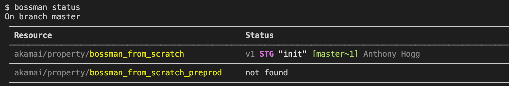
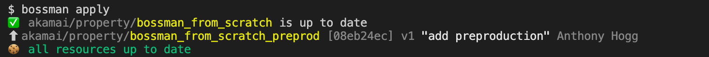
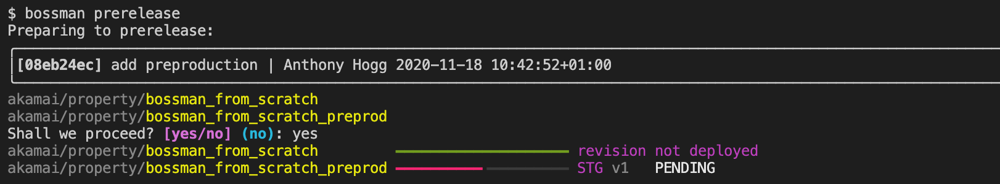
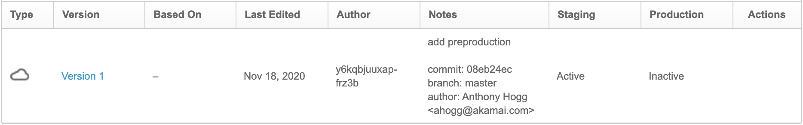
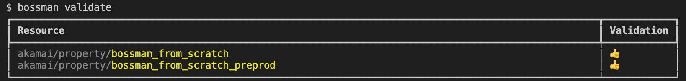
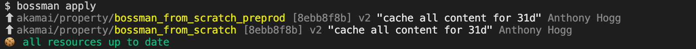
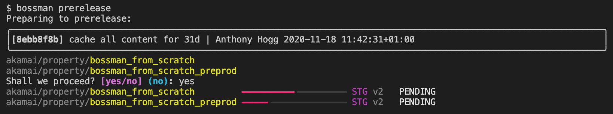

.. _quickstart_akamai_parallel_environments:

Akamai : Parallel Environments
====================================

In this scenario, we will build on the :ref:`quickstart_akamai_simple_property` quickstart.
and add a preproduction environment.

Requirements
____________________________________

- You have completed the :ref:`quickstart_akamai_simple_property` quickstart

Where we are
____________________________________

You should have the following in your repository::

  $ tree
  .
  └── akamai
      └── property
          └── bossman_from_scratch
              ├── hostnames.json
              └── rules.json

  3 directories, 2 files

Adding preproduction
____________________________________

.. code-block:: bash

   cp -R akamai/property/bossman_from_scratch{,_preprod}

**Important:** We must now update the ``hostnames.json`` file so that it
serves a different hostname.

.. code-block:: json
  :linenos:
  :emphasize-lines: 3

  [
    {
        "cnameFrom": "bossmanfromscratch-preprod.example.com",
        "cnameTo": "your-edge-hostname.edgesuite.net",
        "cnameType": "EDGE_HOSTNAME"
    }
  ]

Let's make a quick detour now and run ``bossman status``:

.. image:: simple_property/bossman_from_scratch_status_prereleased.png

Our new environment is not shown! This is because bossman only concerns itself with
commits, by design.

.. code-block:: bash

  git add akamai/property/bossman_from_scratch_preprod
  git commit -m "add preproduction"

Now the new environment is tracked by bossman:

Deployment
____________________________________

Just as we did previously, it is now time to deploy our change:

There was no change to deploy to the ``bossman_from_scratch`` property, and
v1 of ``bossman_from_scratch_preprod`` was created as expected.

Prerelease
____________________________________

Now let us prerelease our new configuration to the staging network.

Note that because the commit did not touch ``bosssman_from_scratch``, it was not
deployed, so bossman does not attempt to activate it.

We can check that all is in order in Akamai Control Center:

Making a change on both environments
____________________________________

By default, only HTTP ``GET`` requests are allowed on the Akamai platform. Allowing the use
of more methods is quite easy, though. Let's support ``POST``!

Simply add lines 44-51 highlighted below to both files:

- akamai/property/bossman_from_scratch/rules.jsonn
- akamai/property/bossman_from_scratch_preprod/rules.jsonn

Do NOT copy paste the entire JSON here, since it contains placeholders that you
already filled in with different values previously.

.. code-block:: json
  :linenos:
  :force:
  :emphasize-lines: 2,3,4,24,40,52-58

  {
    "contractId": "YOUR_CONTRACT_ID",
    "groupId": "YOUR_GROUP_ID",
    "productId": "YOUR_PRODUCT_ID",
    "ruleFormat": "v2020-03-04",
    "rules": {
        "name": "default",
        "comments": "The behaviors in the Default Rule apply to all requests.",
        "options": {
          "is_secure": false
        },
        "behaviors": [
          {
              "name": "origin",
              "options": {
                "cacheKeyHostname": "ORIGIN_HOSTNAME",
                "compress": true,
                "customValidCnValues": [
                    "{{Origin Hostname}}",
                    "{{Forward Host Header}}"
                ],
                "enableTrueClientIp": false,
                "forwardHostHeader": "REQUEST_HOST_HEADER",
                "hostname": "httpbin.org",
                "httpPort": 80,
                "httpsPort": 443,
                "originCertsToHonor": "STANDARD_CERTIFICATE_AUTHORITIES",
                "originSni": true,
                "originType": "CUSTOMER",
                "standardCertificateAuthorities": [
                    "akamai-permissive"
                ],
                "verificationMode": "PLATFORM_SETTINGS"
              }
          },
          {
              "name": "cpCode",
              "options": {
                "value": {
                    "id": YOUR_CPCODE_ID
                }
              }
          },
          {
              "name": "caching",
              "options": {
                "behavior": "MAX_AGE",
                "mustRevalidate": false,
                "ttl": "31d"
              }
          },
          {
            "name": "allowPost",
            "options": {
               "allowWithoutContentLength": false,
               "enabled": true
            }
         }
      ]
    }
  }

Now use ``bossman validate`` to run superficial syntax checks on your working copy...

If you get thumbs up, great! If not, double-check the JSON.

Our next step is to deploy the change - you're getting used to this by now :)

Now, we can activate on the Akamai staging network:

Closing Remarks
____________________________________

Bossman made it very easy to deploy and activate the configurations. But a few things could
be improved:

* **You repeated yourself** when setting up the ``allowPost`` behaviour, this is (sometimes) an
  engineering anti-pattern and there would be value in avoiding it!

Because bossman does not concern itself with how you build the configuration JSON and only
cares about how it is changed over time, you can use a template tool as a valuable complement.
This will allow you to manage your core configuration template in one place and automatically
specialize it for the different environments you maintain.

* **It would have been nice to test the caching behaviour on preprod first** if this is your
  usual workflow...

In this tutorial we showed how all configurations could be kept in lockstep, but bossman
supports the "preprod then prod" workflow with equal ease.

We will cover these in later tutorials.
