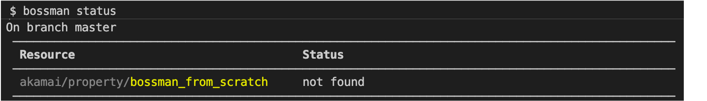
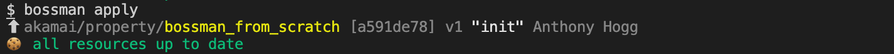
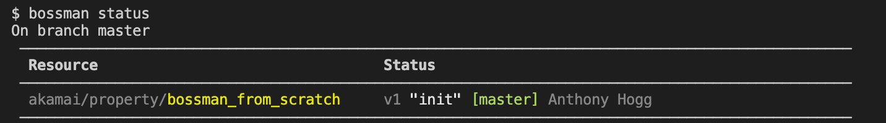
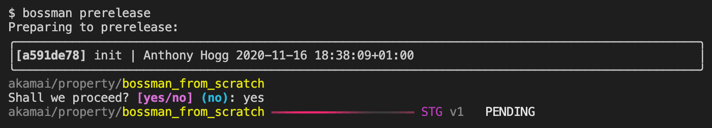
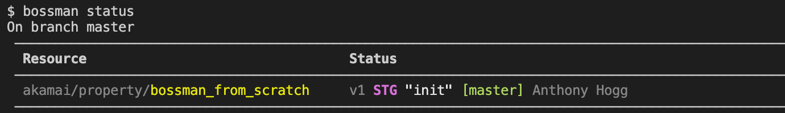
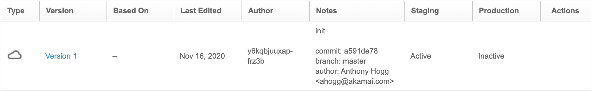

.. _quickstart_akamai_simple_property:

Akamai : Simple Property
====================================

In this scenario, we will create a CDN property from scratch and make a simple change.

Requirements
____________________________________

- Bossman (:ref:`install`)
- Access to `Akamai Control Center <control.akamai.com>`_
- (Recommended) A dedicated Access Control Group (ACG, a folder in the control center)
- (Recommended) Akamai OPEN credentials restricted to the ACG with read-write PAPI v1 privileges
- A Content Provider Code
- A domain name (this tutorial will refer to ``example.com``)
- A Standard TLS Akamai Edge Hostname

We will be using `<https://httpbin.org>`_ as an origin server, but you are free to use a different one
if you prefer.

Initializing the repository
____________________________________

.. code-block:: bash

  git init bossman_quickstart_akamai_simple_property

Preparing the directory structure
____________________________________

By default, bossman expects the following tree structure::

  $ tree
  .
  └── akamai
      └── property
          └── bossman_from_scratch
              ├── hostnames.json
              └── rules.json

  3 directories, 2 files

The ``akamai/property`` prefix identifies the plugin to use. The Akamai property plugin expects subdirectories to be property names.
With this file tree, we will be managing a property called ``bossman_from_scratch``.

  Two Akamai properties cannot have the same name within an account!

Creating this structure is trivial:

.. code-block:: bash

  mkdir -p akamai/property/bossman_from_scratch

Creating the ``hostnames.json`` file
____________________________________

This file describes the hostname mapping for the property, more information here:

`PAPI V1 : PUT Property Hostnames <https://developer.akamai.com/api/core_features/property_manager/v1.html#putpropertyversionhostnames>`_.

You can use this as a template

.. code-block:: json
  :linenos:

  [
    {
        "cnameFrom": "bossmanfromscratch.example.com",
        "cnameTo": "your-edge-hostname.edgesuite.net",
        "cnameType": "EDGE_HOSTNAME"
    }
  ]

Simply make sure you replace ``example.com`` and ``your-edge-hostname`` with your
own values.

Creating the ``rules.json`` file
____________________________________

This file describes the delivery and caching rules that should be applied to traffic
served by the configuration.

It obeys a schema described in the `PAPI Feature Catalog Reference <https://developer.akamai.com/api/core_features/property_manager/v1.html#versioning>`_.
This schema is versioned, and we will use a frozen version for the sake of stability in this tutorial.

You can use the following as a template:

.. code-block:: json
  :linenos:
  :force:
  :emphasize-lines: 2,3,4,24,40

  {
    "contractId": "YOUR_CONTRACT_ID",
    "groupId": "YOUR_GROUP_ID",
    "productId": "YOUR_PRODUCT_ID",
    "ruleFormat": "v2020-03-04",
    "rules": {
        "name": "default",
        "comments": "The behaviors in the Default Rule apply to all requests.",
        "options": {
          "is_secure": false
        },
        "behaviors": [
          {
              "name": "origin",
              "options": {
                "cacheKeyHostname": "ORIGIN_HOSTNAME",
                "compress": true,
                "customValidCnValues": [
                    "{{Origin Hostname}}",
                    "{{Forward Host Header}}"
                ],
                "enableTrueClientIp": false,
                "forwardHostHeader": "REQUEST_HOST_HEADER",
                "hostname": "httpbin.org",
                "httpPort": 80,
                "httpsPort": 443,
                "originCertsToHonor": "STANDARD_CERTIFICATE_AUTHORITIES",
                "originSni": true,
                "originType": "CUSTOMER",
                "standardCertificateAuthorities": [
                    "akamai-permissive"
                ],
                "verificationMode": "PLATFORM_SETTINGS"
              }
          },
          {
              "name": "cpCode",
              "options": {
                "value": {
                    "id": YOUR_CPCODE_ID
                }
              }
          }
        ]
    }
  }

Quick validation
____________________________________

Bossman can help you validate your working copy using this command:

.. code-block:: bash

  bossman validate

This will list each resource with a thumbs up emoji if validation passed.

|  This is only a very superficial validation that helps with:
|  - JSON syntax errors
|  - validity according to the schema

First commit & deployment
____________________________________

Bossman does not deploy from working copy, so we need to commit our changes.

.. code-block:: bash

  git add akamai
  git commit -m "init"

Before deploying this change, we can check the status:

We can create the property and deploy the change from here:

And we can look at the status again:

Activating to staging
____________________________________

Now we are ready to activate the property to staging.

After the process completes, we can check the status again:

We have an indication that v1 is active on the staging network.

And we can see the result of our efforts in Akamai Control Center!

Congratulations!
____________________________________

Next step: :ref:`quickstart_akamai_parallel_environments`